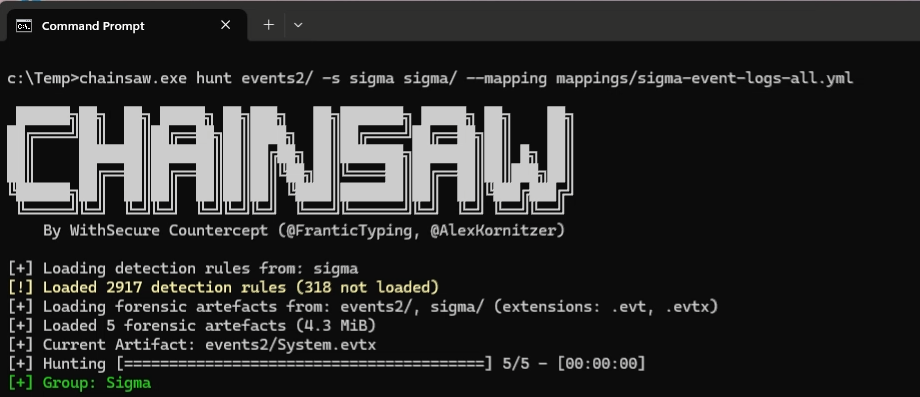
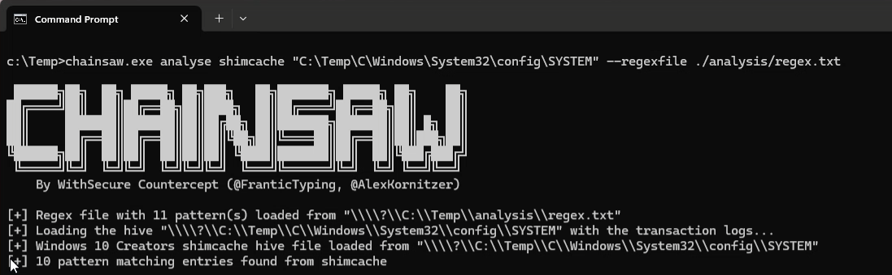
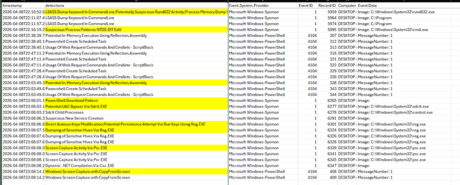
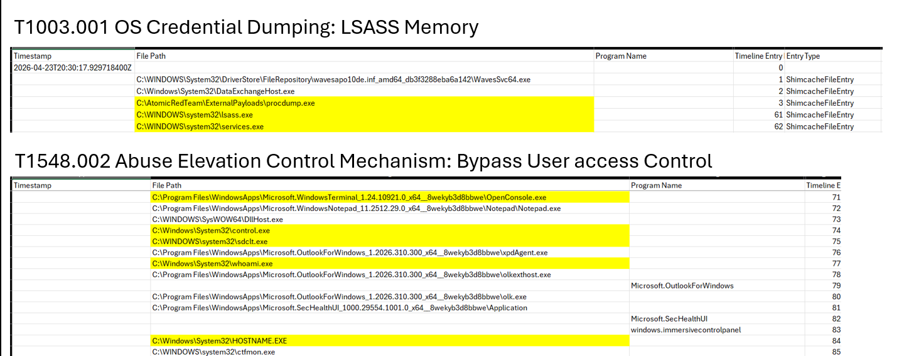

# 🪚 Detecting Living off the Land Attacks with Chainsaw

## Project Overview
This project utilizes Chainsaw to ingest and analyze Windows event logs collected from a victim host and apply sigma rules to detect LotL techniques. Chainsaw is an open-source command-line tool for rapid triage of Windows event logs using sigma rules to detect malicious behavior and known attack patterns in logs. Chainsaw can also be ran against the system registry hive for shimcache analysis. 
#### Living off the Land Attacks
Living off the Land is a type of cyber-attack that uses legitimate system tools to carry out malicious actions. These tools are usually pre-installed and used for normal processes, so file signatures cannot be used to detect these attacks in the way that malware would be with antivirus tools, making detection more difficult. Detecting these attacks relies on analyzing known patterns of activity.  
#### Sigma Rules  
Sigma rules are YAML-based detection definitions used in SIEM and log management tools. They define the logic for suspicious activity such as process creations, registry modifications, file access, etc., enabling detection of these events. Because LotL attacks often bypass antivirus tools, sigma rules are extremely valuable for detecting the patterns of activity seen in these techniques.
#### ShimCache Analysis
The Application Compatibility Cache (ShimCache) is an artifact found in the System registry hive on a Windows machine. It contains entries of programs executed on the system, including timestamp and filepaths. Analyzing the Shimcache is useful in incident response to see previously executed programs even after they are deleted, detect traces of malware, and build a timeline of execution activity. 
## Project Relevance
Why use Chainsaw when security tools like SIEMs and EDRs can use sigma rules to automatically collect and alert on suspicious activity? The answer is that not every environment is going to have these security tools. Incident responders may go into environments with less mature security programs, where central log collection and detection has not been implemented. Endpoint security agents can also break or become corrupted and fail to properly report in to security consoles. Event Viewer is the native, default tool for viewing event logs, but Event Viewer is often extremely slow to load and filter logs and does not offer in-depth analysis capabilities. When a security incident occurs, responders need a tool that allows quick triage of an endpoint, which is where Chainsaw can be a valuable tool for rapid analysis and detection.

## Methodology
### Setup & Test Environment
- Windows 11 Virtual Machine:
    - Disabled Windows Defender
    - Installed Sysmon and Enabled Sysmon event logging


###    Tools, Frameworks, and Datasets

#### Tools
- Chainsaw
    - https://github.com/WithSecureLabs/chainsaw/tree/master
- Sigma Ruleset
    - https://github.com/sigmahq/sigma
- Invoke-AtomicRedTeam PowerShell Module
    - https://www.atomicredteam.io/docs/invoke-atomicredteam
- KAPE - Kroll Artifact Parser and Extractor
    - https://www.kroll.com/en/publications/cyber/kroll-artifact-parser-extractor-kape


#### Frameworks
- MITRE ATT&CK Emulation Library - APT29
    - https://attackevals.github.io/ael/enterprise/apt29/emulation_plan/scenario_1/
- MITRE ATT&CK Navigator - Volt Typhoon 
    - https://mitre-attack.github.io/attack-navigator//#layerURL=https%3A%2F%2Fattack.mitre.org%2Fgroups%2FG1017%2FG1017-enterprise-layer.json
- LOLBAS Project 
    - https://lolbas-project.github.io/


### Step-by-Step Guide
#### 1. Attack Emulation for Log Collection
##### A. Technique Selection
To recreate the Windows event logs to be used in Chainsaw analysis, attacks were emulated from two adversaries known for using LotL techniques; Volt Typhoon and APT29. The MITRE ATT&CK Emulation Library and MITRE ATT&CK Navigator were used to map the adversary techniques to the LOLBAS project.

The following techniques were chosen:

APT29  
T1105 Ingress Tool Transfer
T1548.002 Abuse Elevation Control Mechanism: Bypass User access Control  
T1543.003 Create or Modify System Process: Windows Service  
T1547.001 Boot or Logon Autostart Execution: Registry Run Keys / Startup Folder  
T1003.002 OS Credential Dumping: Security Account Manager  
T1113 Screen Capture  
T1547.001 Boot or Logon Autostart Execution: Registry Run Keys / Startup Folder

Volt Typhoon  
T1003.001 OS Credential Dumping: LSASS Memory  

##### B. Victim Host Setup
A Windows 11 virtual machine was used as the victim host. The following settings were configured: 
- Windows Defender disabled
- Sysmon installed with event logging enabled

##### C. Install Invoke-AtomicRedTeam PowerShell Module
Open PowerShell as Admin and run the following commands:
```PS
# Install Invoke-AtomicRedTeam
Install-Module -Name invoke-atomicredteam,powershell-yaml -Scope CurrentUser

# Import the module
Import-Module "C:\AtomicRedTeam\invoke-atomicredteam\Invoke-AtomicRedTeam.psd1" -Force
$PSDefaultParameterValues = @{"Invoke-AtomicTest:PathToAtomicsFolder" = "C:\AtomicRedTeam\atomics"}
```   

##### D. Execute the Attack Techniques
To automate the execution of the selected techniques, list the AtomicRedTeam technique names in a text file "Techniques.txt" and save it to a new folder to be used in the PowerShell Scripts.

```
# Techniques.txt
T1105-15
T1548.002-7
T1543.003-3
T1547.001-1,6
T1003.002-1
T1113-7,8
```
To ensure that the AtomicRedTeam requirements are met for each technique, run the following PowerShell script to install the prerequisites:
```PS
$techniques = Get-Content -path "C:\Temp\Techniques.txt"
try {
foreach ($t in Stechniques) {
Invoke-AtomicTest $t -GetPreqs
}
} Catch {
write-Host "$t prereq not installed"
}
```   
After installing all necessary prerequisites, execute the attack techniques with the following PowerShell script:
```PS
$techniques = Get-Content -path "C:\Temp\Techniques.txt"
try {
foreach ($t in Stechniques) {
Invoke-AtomicTest $t
Write-Host "Technique $t executed successfully"
}
} Catch {
write-Host "$t could not be executed"
}
```  

##### E. Event Log Collection
Once the attack techniques finish executing, navigate to the Windows event log files located in:  

C:\Windows\System32\winevt\Logs  

Copy the following log files to a new folder:
- Application.evtx
- Security.evtx
- Microsoft-Windows-PowerShell%4Operational.evtx
- System.evtx
- Sysmon.evtx

##### F. Extract System Hive with KAPE
To extract the System registry hive for Shimcache analysis, open a Command Prompt as Admin and change the working directory to the folder where KAPE has been downloaded to. Run the following command:

```BASH
kape.exe --tsource C: --tdest C:\<target folder> --target RegistryHives
```

##### g. Clean-up Attack Executions
To clean-up the Winows host after unning the attack techniques, run the following PowerShell Script:

```PS
$techniques = Get-Content -path "C:\Temp\Techniques.txt"
foreach ($t in Stechniques) {
Invoke-AtomicTest $t -Cleanup
}
```


#### 2. :mag_right: Chainsaw Analysis

Now that the Event Logs and System Hive have been acquired, it is time to analyze them using Chainsaw. Download the Chainsaw tool and the Sigma Ruleset. Copy the Sigma Rules folder, the event logs folder, and the System Hive file into the Chainsaw folder. 

Open the command prompt and navigate to the Chainsaw directory.

##### A. Event Log Detection  

To analyze the Windows event logs using Sigma rule detection and output the results to a .csv file, run the following command:
```BASH
chainsaw.exe hunt events/ -s sigma sigma/ -- mapping mappings/sigma-event-logs-all.yml --csv --output C:\<path to csv>\results.csv
```
 


##### B. Shimcache Analysis
To analyze the Shimcache, we can create custom rules using regex to look for files of interest based on the results from the event log detections. 
```
# Regex.txt
.* \\Software\\Classes\\ms-settings\\shell\\open\\command$
.* \\System32\\ .* \.exe$
.* \\Microsoft\\Windows\\Start Menu\\Programs\\Startup\\ .* $
.* \\Software\\Microsoft\\Windows\\CurrentVersion\\Run\\ .* $
.* reg\.exe .* save .* (samlsystemlsecurity)$
.* (Get-Screenshot|Take-Screenshot|ScreenCapture) .* $
.* \\(mshta|scrcons|mofcomp|cmstp|hh|ieexec|msiexec|installutil|regsvr32)\.exe$
.* \(fodhelperlcomputerdefaults|sdclt|sluileventywr)\.exe$
.* (System32)\\(svchost|lsass|smss|wininit|taskhost|services|lsass|csrss|explorer)\.exe$
.* \.(pdfltxtldocxlzip)\.exe$
.* \\(powershe11|pwsh|wscript|cscript|cmd|bash)\.exe$|
```

To analyze the Shimcache from the System Hive and output the results to a .csv file, run the following command:
```BASH
chainsaw.exe analyse shimcache "C:\<path to System Hive file>\C\Windows\System32\config\SYSTEM" --regexfile ./analysis/regex.txt --output C:\<path to csv>\shimcache.csv
```
 


## Results
After running Chainsaw against the Windows event logs and the Shimcache, the resulting .csv files were then analyzed. Chainsaw was successful in detecting the 7 LotL techniques ran on the victim host, though manual analysis of the results is required to identify the file paths and executables involved in the findings. 

The results from the Sigma Rules shows 36 detections. Multiple detections are shown for each of the 7 techniques representing the multiple processes involved in each technique. The detections include:
- Timestamp
- Event Log Path
- Detection Description
- count
- Event Log Source 
- Event ID
- Hostname
- Event Data containing the files and commands that were executed  

[Sigma.csv](Sigma.csv)  
 

The results from the Shimcache analysis show a timeline of the executed events. The results from the Sigma detections can be mapped to the Shimcache timestamps to see the child processes and order of execution for each technique. The results include:
- Timestamp of execution
- Filepath of program executed
- Program Name
- Timeline Entry Number


[Shimcache.csv](Shimcache.csv)  

## Conclusion
### :key: Key Takeaways
Chainsaw offers robust offline, post-compromise analysis capabilities allowing for rapid parsing and detection of suspicious activity in Windows artifacts.

The key takeaway from this project is the importance of supplementary tools like Chainsaw for incident responders to keep in their toolkit. Security tools like SIEMs and EDRs are often more powerful and offer greater capabilities when it comes to incident triage, but these tools are not always available. These primary defenses are not implemented in every environment. If they are, they can be misconfigured or compromised in the event. In isolated or air-gapped networks, endpoints also may not be connected to these security tools. 

Tools like Chainsaw give responders resiliency in these situations, allowing them to recover visibility, analyze attacker behavior, and continue response efforts without delay. Strong incident response capability includes having layered, independent tools that still work when others fail. 

## Acknowledgements
Chainsaw: https://github.com/WithSecureLabs/chainsaw/tree/master  
Sigma Rules: https://github.com/sigmahq/sigma  
AtomicRedTeam: https://www.atomicredteam.io/  
KAPE: https://www.kroll.com/en/publications/cyber/kroll-artifact-parser-extractor-kape  
LOLBAS Project: https://lolbas-project.github.io/  

## References
https://attackevals.github.io/ael/enterprise/apt29/emulation_plan/scenario_1/  
https://mitre-attack.github.io/attack-navigator//#layerURL=https%3A%2F%2Fattack.mitre.org%2Fgroups%2FG1017%2FG1017-enterprise-layer.json  
https://medium.com/@atnoforcybersecurity/detecting-living-off-the-land-lolbas-attacks-with-sigma-rules-340e441fc444  
https://www.microsoft.com/en-us/security/blog/2023/05/24/volt-typhoon-targets-us-critical-infrastructure-with-living-off-the-land-techniques/  
https://www.picussecurity.com/resource/glossary/what-is-sigma-rule  
https://www.cisa.gov/sites/default/files/2024-03/aa24-038a_csa_prc_state_sponsored_actors_compromise_us_critical_infrastructure_3.pdf  
## Author
Mackenzie Cronin
